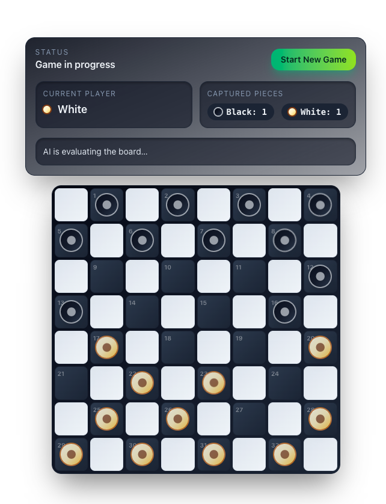

# llm-checkers

An experiment in building a modern checkers game with React 19 and Next.js 16. It mixes new platform features (View Transitions API, CSS Anchor Positioning, server actions/functions) with structured AI decision-making powered by the Vercel AI SDK.

## Tech Stack

- Next.js 16 App Router with server functions (`"use server"`) for AI turns
- React 19 with the `ViewTransition` API for smooth board updates
- TypeScript + Zod for schema validation and structured LLM outputs
- Tailwind CSS 4 for layout and styling
- Vercel AI SDK (model agnostic) with OpenAI `gpt-4o`

## Architecture Highlights

- **Server actions/functions for AI:** `src/server-functions/ai.ts` runs on the server and is invoked from the client controls to pick the AI move. It uses the Vercel AI SDK’s `generateText` with `experimental_output` for strongly-typed, validated moves and `stepCountIs` to cap tool-call depth.
- **Tool-driven game understanding:** The AI calls scoped tools (current player, board info, valid moves) instead of raw text prompts. These tools are thin wrappers around selectors, which keeps the model inside legal move space and mirrors the game’s authoritative state. It also prevents prompt injection attacks.
- **State management:** A `useReducer` store (`src/game/store.ts`) and React context (`src/context/checkers-game-context.tsx`) drive the game loop. Selectors derive view-ready data (pieces, captured pieces, valid moves, results) from a bitboard representation, and `startTransition` keeps UI responsive during move dispatches.
- **UI and layout techniques:** The board uses CSS Anchor Positioning (`anchorName` on squares and `positionAnchor` on pieces) so pieces stay tethered to their squares without manual positioning math. Pieces are wrapped in React 19 `ViewTransition` boundaries for animated movement when the board state changes.
- **Game rules enforcement:** Validation happens in the reducer/bitboard layer (mandatory captures, chain captures, promotions). The AI runs against the same selectors, ensuring parity between human and AI turns.

## Bitboard + Context Abstractions

- **Bitboard storage:** Pieces live in a `Uint32Array` (`src/game/bitboard.ts`) with bit masks for color/king flags and shifted IDs. This keeps reads/writes fast and compact.
- **Selectors as the public API:** Context never exposes raw bitboards. Instead, selectors (`src/game/selectors.ts`) decode the board into view-friendly `CheckersPiece` objects, compute valid moves, track captured pieces, and derive game results.
- **Reducer as the single source of truth:** `src/game/store.ts` applies moves against the bitboard, enforcing rules and updating history. The React context wraps the reducer so components (and the AI tools) only interact through typed helpers.
- **Shared invariants for AI and UI:** Both the UI and the server AI tools pull from the same selector layer, ensuring consistent legality checks and preventing the AI from generating moves the reducer would reject.

## AI Approach

- Model: OpenAI `gpt-4o` via the Vercel AI SDK.
- Structured output: Zod schema enforces `{ pieceId, to }`, preventing free-form or illegal moves.
- Tooling: Custom tools expose only the necessary board facts and valid moves. The model must call `getValidMovesForPiece` before deciding, which aligns model output with enforced rules.
- Turn loop: Client controls trigger the server function each time it’s the AI’s turn, and the validated move is dispatched back through the shared reducer.

## Setup Notes
- Requires Node + npm/pnpm. Run `npm install` (or `pnpm install`).
- Create `.env.local` with `OPENAI_API_KEY=...` so server functions can call the model.
- Start locally with `npm run dev`; the AI runs through server functions only, never on the client.